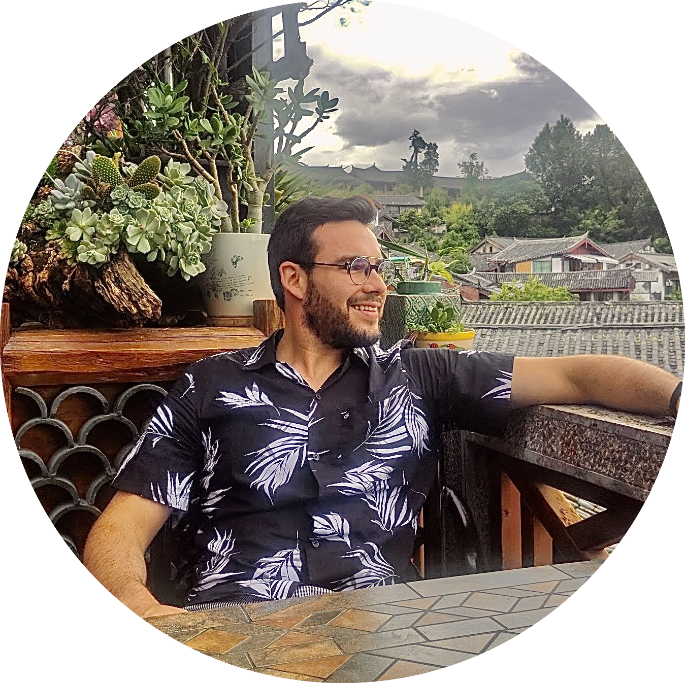

<!-- ## About Me -->

✔️ My **Mission**: Empower society with smarter technology every day.
🔆 My **Vision**: Drive inherent transformation and unique growth to the tech industry.  
🌠 My **Passion**: Use data and technology to answer the "why" behind complex business problems.

👨‍💻 Currently, I am a Product Data Scientist at [Triage](https://www.triage.com/), bringing AI technologies to healthcare products. At Triage, I develop artificial intelligence solutions for dermatology that keep learning and making better predictions from users every day.

🌃 At nights, I curate [Productize ML](https://productize.ml/), an instruction guide for Developers and Product Managers building Machine Learning products.

💡 I love using innovative thinking, strategic planning, and data-driven decision making to help support the businesses and projects that I work on, both personally and professionally. Nothing makes me happier than to know that what I implement can make processes more efficient and that I create insight into KPIs that improve business function.

🎓 I am currently enrolled in the Online Master of Science in Computer Science ([OMSCS](http://www.omscs.gatech.edu/)) at [Georgia Institute of Technology](https://www.gatech.edu/) graduating in December 2021. In 2017, I graduated from [Polytechnic University of Catalonia](https://www.upc.edu/en) in Electrical Engineering. I completed my Bachelor’s Thesis at [Florida Atlantic University](http://www.ceecs.fau.edu/) about Deep Learning techniques applied to Medical Imaging in 2016.

<!-- Add icon library -->
<link rel="stylesheet" href="https://cdnjs.cloudflare.com/ajax/libs/font-awesome/4.7.0/css/font-awesome.min.css">

Find me on  
 or email me at *adriaromero [at] me [dot] com* .

# News    

* *Nov 2019* - I am invited to give a talk at the [Novartis' I+Derma](https://drive.google.com/open?id=1lZT6lhpJagCvvbrWNNF7HzIlZVPXaMuV) talks. [📹](https://cdnapisec.kaltura.com/html5/html5lib/v2.76/mwEmbedFrame.php/p/2076321/uiconf_id/40166251/entry_id/1_qkvraeku?wid=_2076321&iframeembed=true&playerId=kaltura_player_1580707787&entry_id=1_qkvraeku)

* *Nov 2018* - Our artwork [*Life on Mars?*](https://artifyearth.co/) will be displayed at
[NeurIPS 2018 Workshop on Machine Learning for Creativity and Design](https://nips2018creativity.github.io/).
[🐦](https://twitter.com/adriaromero/status/1071446311797485569)

* *Nov 2018* - I will be presenting Triage's latest work at the Self-Organizing Conference on Machine Learning (SOCML) in Google's Toronto office.

* *Jul 2018* - I was accepted to attend to [MISS 2018](http://iplab.dmi.unict.it/miss/). [🐦](https://twitter.com/adriaromero/status/1024427158209536001)

* *Jun 2018* - [*"Skin lesion detection from dermoscopic images using CNNs"*](https://www.slideshare.net/AdriRomeroLpez/adriabscthesis)
has been awarded as best Bachelor thesis in the field of telecommunications engineering. [🐦](https://twitter.com/adriaromero/status/1007447663158218753)

* *May 2017* - I will be representing Triage at [NVIDIA GTC](https://www.nvidia.com/en-us/gtc/) Conference in San Jose (California).
[[session]](https://gputechconf2017.smarteventscloud.com/connect/sessionDetail.ww?SESSION_ID=118921&tclass=popup)
[[slides]](http://on-demand.gputechconf.com/gtc/2017/presentation/s7842-tory-jarmain-how-triage-is-detecting-skin-cancer-from-smartphones-with-deep.pdf)

* *Apr 2017* - I start working at [Triage](https://www.triage.com/about).

 
# Industry Experience

## Product Data Scientist
[Triage](https://www.triage.com)
 
Apr 2018 - Current
 
*Toronto, Canada*
 
<a id="triage-job-botton" onclick="show_text('triage-senior-job')">[description]</a>

<blockquote>
• Developed AI solution able to recognize over 500 skin conditions with accuracy superior to dermatologists currently piloted at leading hospitals including Stanford Medicine, MSK Cancer Centre, MD Anderson Cancer Center, and Sunnybrook Hospital. 
• Lead Data Scientist responsible for Machine Learning infrastructure. 
• Managed and executed the holistic product development of the rejection gate, visual classifier, and question&answer system by identifying users needs. 
• Establish strategic partnerships with pharmaceutical companies and hospitals such as Novartis and Sanitas (Bupa group). 
• Due diligence and communication with potential investors and stakeholders. 
• Co-author and contributor of several company patents (filed, approval pending), FDA application, core technology, and whitepaper and benchmarking reports. 
• Generated business leads by representing company in science conferences (Google, NeurIPS), hospital talks (Hospital Clinic) and medical conferences (Novartis). 
</blockquote>

## Machine Learning Engineer
[Triage](https://www.triage.com)
 
Apr 2017 - Apr 2018
 
*Toronto, Canada*
 
<a id="triage-job-botton" onclick="show_text('triage-job')">[description]</a>

<blockquote>
• Development of the dermatology Machine Learning solutions including CNNs and decision trees. 
• Data Management and organization using medical ontologies. 
• Development of engineering infrastructure and operations. 
</blockquote>

## Founder and Instructor
[Productize ML](https://productize.ml/)
 
Jan 2020 - Current
 
*Toronto, Canada*
 
<a id="productize-ml-botton" onclick="show_text('productize-ml-job')">[description]</a>

<blockquote>
Productize ML helps Developers and Product Managers building Machine Learning products to learn the technology in deep as well as to bridge the gap from the theory and deployment of AI systems to real users.
</blockquote>

## Machine Learning Engineer Intern
[Insight Centre for Data Analytics](https://www.insight-centre.org/)
 
Feb 2017 - Apr 2017
 
*Dublin, Ireland*
 
<a id="insight-job-botton" onclick="show_text('insight-job')">[description]</a>

<blockquote> I assisted in a project focused on multi-objective learning in deep networks that combined discriminative
unsupervised learning with classic supervised learning over large partially labelled data sources to fit
highly-generalizable models. </blockquote>

## Scholarship Program
[Huawei](https://www.huawei.com/)
 
Jun 2016 - Jul 2016
 
*Beijing, China*
 
<a id="huawei-botton" onclick="show_text('huawei-job')">[description]</a>

<blockquote> Seeds for the Future scholarship program that included hands-on training on ICT Technologies & Solutions and first-hand experience at Huawei's Shenzhen headquarter. </blockquote>

## Founder
[laFarmacoteca](http://lafarmacoteca.es/)
 
Sept 2014 - Apr 2017
 
*Barcelona, Spain*
 
<a id="lafarmacoteca-botton" onclick="show_text('lafarmacoteca-job')">[description]</a>

<blockquote> e-Commerce pharmacy. </blockquote>

## Elite/Premier Channel Partner Assistant
[Schneider Electric](https://www.se.com/)
 
Jan 2016 - Jun 2016
 
*Barcelona, Spain*
 
<a id="se-botton" onclick="show_text('se-job')">[description]</a>

<blockquote> Assisted in coordinating sales and marketing activities, aided in the planning and execution of programs and events and training of strategic ICT division partners. Helped on managing the existing Elite / Premier Partners as well as in the recruiting of future ones. </blockquote>

 
# Education

## M.Sc. in Computer Science
[Georgia Institute of Technology](https://www.gatech.edu/) (GaTech)
 
*Atlanta, USA*
 
January 2020 - January 2021 (*Expected*)

## Visiting Student
[Florida Atlantic University](http://www.ceecs.fau.edu/)
 
Aug 2016 - Feb 2017
 
*Boca Raton, Florida, USA*
 
<a id="fau-visiting-botton" onclick="show_text('fau-visiting')">[description]</a>
[[thesis]](https://www.slideshare.net/AdriRomeroLpez/adriabscthesis)

<blockquote> The thesis focuses on the problem of automatic skin lesion detection, particularly on melanoma detection, by applying semantic segmentation and classification from dermoscopic images using a deep learning-based approach. </blockquote>

## B.Sc. in Telecommunications Engineering
[Polytechnic University of Catalonia](https://www.upc.edu/en) (UPC)
 
*Barcelona, Spain*
 
Sept 2011 - Jan 2017
 

 
# Talks

**Detect Disease in a Snap**
 
*Nov 2019. [Novartis I+Derma](https://drive.google.com/open?id=1lZT6lhpJagCvvbrWNNF7HzIlZVPXaMuV), Madrid, Spain.* [[video]](https://cdnapisec.kaltura.com/html5/html5lib/v2.76/mwEmbedFrame.php/p/2076321/uiconf_id/40166251/entry_id/1_qkvraeku?wid=_2076321&iframeembed=true&playerId=kaltura_player_1580707787&entry_id=1_qkvraeku) [🐦](https://twitter.com/adriaromero/status/1193861331260264448?s=20)

**Q&A-informed image-based deep learning for skin disease recognition in the real world**
 
*Nov 2018. Google's Office, Toronto, Canada.*

**[Towards skin disease recognition using deep learning](https://imatge.upc.edu/web/info/gpi-seminar-series-towards-skin-disease-recognition-using-deep-learning-jul-26th-2018)**
 
*Jul 2018. UPC - GPI Seminar Series, Barcelona, Spain.*
 <a id="gpi-seminar-botton" onclick="show_text('gpi-seminar')">[abstract]</a>
[🐦](https://twitter.com/adriaromero/status/1022536929986977792)

<blockquote> Skin disorders are one of the most common reasons why patients visit their primary care physicians. 1 in
3 cancer diagnoses is skin cancer and 1 in 5 Americans will develop skin cancer in their lifetime. The average wait time
to see a dermatologist in the United States is 1 month and even greater in other parts of the world. In that time skin
disorders can worsen or become life threatening. The recent emergence of machine learning and deep learning methods for
medical image analysis has enabled the development of intelligent medical imaging-based diagnosis systems that can assist
physicians in making better decisions about a patient’s health. In particular, skin imaging is a field where these new
methods can be applied with a high rate of success. In this talk you will learn how Triage, a Toronto based startup
is using deep learning to diagnose any skin disease through real case studies, few months prior to become one of the
first healthcare companies using AI to be approved by the U.S. Food & Drugs Administration (FDA).
</blockquote>

**Some insights and Deep Learning in a nutshell**
 
*Oct 2017. [Universitat Politecnica de Valencia](http://www.upv.es/) (UPV), Valencia, Spain.*
[🐦](https://twitter.com/adriaromero/status/922252187337723904)

**[Hospital Clínic](https://www.hospitalclinic.org/en)** - [Medicine and Dermatology](https://www.hospitalclinic.org/en/healthcare/hospital-care/medicine-and-dermatology-icmid)
(ICMiD) to [Dr. Susana Puig](https://www.researchgate.net/profile/Susana_Puig), [Dr. Josep Malvehy](https://www.researchgate.net/profile/Josep_Malvehy)
and their team as audience.
 
*Jul 2017. Barcelona, Spain.*

 

# Projects
## Life on Mars?
*GAN-generated images of a terraformed Mars*
 
[NeurIPS 2018 Workshop on Machine Learning for Creativity and Design](https://nips2018creativity.github.io/)
 
Authors: Albert Jimenez, **Adria Romero**, Stephen Solis-Reyes, Mohamed Akrout, Anirudh Challa
<a id="life-on-mars-botton" onclick="show_text('life-on-mars-abstract')">[abstract]</a>
[[website]](https://artifyearth.co/)
[[NeurIPS website]](http://www.aiartonline.com/community/albert-jimenez-adria-romero-lopez-mohamed-akrout-stephen-solis-reyes-anirudh-challa/)

<blockquote> This project attempts to present an artistic representation of Mars after undergoing terraforming by humans.
As a result of this planetary engineering technique, Mars’s surface would adopt a more habitable appearance, similar to
that of the Earth. As an atmosphere is built and temperatures rise, the water cycle begins to take form. Clouds develop,
mountains become covered in snow, rivers start flowing down to the green covered fields, and the rocky Martian deserts
are replaced by trees and forests.
The recreation of that process was performed using an approach based on image to image translation trained on a dataset
based on images of Earth and Mars (fiction and NASA). </blockquote>

## Artify the Earth
*Neural Style Transfer techniques applied to satellite and planet images*
 
Project developed during the [2018 Space Apps Challenge](https://2018.spaceappschallenge.org/) organized by NASA.
 
Authors: Albert Jimenez, **Adria Romero**, Stephen Solis-Reyes, Mohamed Akrout, Anirudh Challa
<a id="artify-the-earth-botton" onclick="show_text('artify-the-earth-abstract')">[abstract]</a>
[[instagram]](https://www.instagram.com/artifyearth/)[[slides]](https://docs.google.com/presentation/d/1RHz_7okBIs_uZ5ODoWuGN0XOV8PKVh-Ej67iy8sla_M/edit?usp=sharing)

<blockquote> There has been a lot of work in image generation using Artificial Intelligence in the last couple of years,
but this work is distinguished from the rest since its novelty in the application of these state-of-the-art technologies
to satellite and planet images. We used the state of the art models of style transfer for this project. We present a
front end tool where users can choose various style options (e.g. Earth, Moon, Mars, Jupiter, etc.) including converting
Earth images to other planets and vice versa. We also have some options to convert images into an artistic impression
(e.g. Picasso, Kandinsky, Van Gogh, da Vinci, etc.) of the image. </blockquote>

## Skin lesion detection from dermoscopic images using Convolutional Neural Networks
*Deep Learning techniques applied to Medical Imaging*
 
Advisor: Dr. [Oge Marques](https://www.ogemarques.com/)
 
Co-Advisor: Dr. [Xavier Giro-i-Nieto](https://imatge.upc.edu/web/people/xavier-giro)
 
<a id="bsc-thesis-botton" onclick="show_text('bsc-thesis')">[abstract]</a>
[[website]](http://adriaromero.net/BSc_Thesis_Skin_Lesion_CNN/)
[[pdf]](https://www.slideshare.net/AdriRomeroLpez/adriabscthesis)
[[slides]](https://www.slideshare.net/xavigiro/skin-lesion-detection-from-dermoscopic-images-using-convolutional-neural-networks)

<blockquote> The recent emergence of machine learning and deep learning methods for medical image analysis has enabled
the development of intelligent medical imaging-based diagnosis systems that can assist physicians in making better
decisions about a patient’s health. In particular, skin imaging is a field where these new methods can be applied with
a high rate of success.

This thesis focuses on the problem of automatic skin lesion detection, particularly on melanoma detection, by applying
semantic segmentation and classification from dermoscopic images using a deep learning based approach.
For the first problem, a U-Net convolutional neural network architecture is applied for an accurate extraction of the
lesion region. For the second problem, the current model performs a binary classification (benign versus malignant) that
can be used for early melanoma detection. The model is general enough to be extended to multi-class skin lesion
classification. The proposed solution is built around the VGG-Net ConvNet architecture and uses the transfer learning
paradigm. Finally, this work performs a comparative evaluation of classifica- tion alone (using the entire image)
against a combination of the two approaches (segmentation followed by classification) in order to assess which of
them achieves better classification results.

Experimental results for the classification task are encouraging: on the ISIC Archive dataset, the proposed method
achieves an accuracy in the top three of the best previously published results. The experimental results of the
segmentation evaluations demonstrate that the proposed method can outperform other state-of-the-art models.</blockquote>

 
# Publications

## Skin Lesion Classification from Dermoscopic Images using Deep Learning Techniques
**Adria Romero-Lopez**, Xavier Giro-i-Nieto, Jack Burdick, Oge Marques
 
13th [IASTED International Conference](https://www.iasted.org/conferences/pastinfo-852.html)
 
*Innsbruck, Austria. 2017*
 
<a id="iasted-abstract-botton" onclick="show_text('iasted-abstract')">[abstract]</a> [[paper]](https://ieeexplore.ieee.org/document/7893267)

<blockquote> The recent emergence of deep learning methods for medical image analysis has enabled the development of
intelligent medical imaging-based diagnosis systems that can assist the human expert in making better decisions about
a patients health. In this paper we focus on the problem of skin lesion classification, particularly early melanoma
detection, and present a deep-learning based approach to solve the problem of classifying a dermoscopic image
containing a skin lesion as malignant or benign. The proposed solution is built around the VGGNet convolutional
neural network architecture and uses the transfer learning paradigm. Experimental results are encouraging: on the
ISIC Archive dataset, the proposed method achieves a sensitivity value of 78.66%, which is significantly higher than
the current state of the art on that dataset.
</blockquote>

## The impact of segmentation on the accuracy and sensitivity of a melanoma classifier based on skin lesion images
Jack Burdick, Oge Marques, **Adrià Romero-López**, Xavier Giró-i-Nieto
 
In Annual Meeting of the [Society of Imaging Informatics in Medicine](https://siim.org/page/SIIM2017) (SIIM).
 
*Pittsburgh, PA, USA. 2017*
 
<a id="siim-abstract-botton" onclick="show_text('siim-abstract')">[abstract]</a> [[paper]](https://upcommons.upc.edu/handle/2117/105582)

<blockquote> We investigated the hypothesis that segmentation improves classification performance of skin lesions
using convolutional neural networks. Examination of classification using different degrees of
segmentation on images from the ISIC Archive dataset with the VGG-16 architecture revealed
unexpected results. Early results indicate that the highest classification performance occurs when a preclassification
segmentation and an unconventional subsequent dilation of the segmentation region is
performed. </blockquote>

 
# Courses

**Medical Imaging Summer School 2018** [[website]](http://iplab.dmi.unict.it/miss/)
 
Sicily, Italy
 
*July 2018*
 

**Deep Learning Specialization by Andrew Ng**
 
[deeplearning.ai](https://www.deeplearning.ai/)
 
*Sep 2017*
 

**Deep Learning for Computer Vision Barcelona** [[website]](http://imatge-upc.github.io/telecombcn-2016-dlcv/)
 
Polytechnic University of Catalonia (UPC)
 
*Summer 2016*
 

**CS231n - Convolutional Neural Networks for Visual Recognition** [[website]](http://cs231n.stanford.edu/)
 
Stanford University
 
*Spring 2016*

 
# Honors & Awards

**Best Bachelor Thesis Award** in the field of telecommunications engineering 2016-2017.
 
*[Universitat Politènica de Catalunya](https://www.upc.edu/en) (UPC) and [UPC Telefónica Catedra](https://catedratelefonica.upc.edu/es).*
 
*Barcelona, Spain.*
*Jun 2018*
 
<a id="gpi-seminar-botton" onclick="show_text('best-thesis')">[summary]</a>
[[thesis]](https://www.slideshare.net/AdriRomeroLpez/adriabscthesis)
[[slides]](https://www.slideshare.net/xavigiro/skin-lesion-detection-from-dermoscopic-images-using-convolutional-neural-networks)

<blockquote>Best Bachelor thesis award in the field of telecommunications engineering 2016-2017. Award issued by
Universitat Politènica de Catalunya (UPC) and UPC Telefónica Catedra. </blockquote>

**Global Talent Stream**
 
Government of Canada - Gouvernement du Canada
 
*Toronto, Canada.*
*May 2018*
 

**Seeds for the Future 2016** Program. *Huawei Technologies Co. Ltd.*
 
*Beijing & Shenzhen, China.*
*Jun 2016*
 
<a id="seeds-for-the-future-botton" onclick="show_text('seeds-for-the-future')">[summary]</a>
[🐦](https://twitter.com/EmbEspChina/status/752690668569583616)

<blockquote>A 2-week work experience scheme in China for 15 students who have successfully completed their 2nd year.
The program offered a week Mandarin language & culture training at a famous university in Beijing; Huawei Training on
ICT Technologies & Solutions; First-hand work experience at Huawei's Shenzhen headquarter; Discover Chinese culture and
historical landmarks.</blockquote>

**Young Research Award 2011** (*Premi de Recerca Jove*). *Government of Catalonia.*
 
*Barcelona, Spain.*
*Jul 2011*
 
<a id="young-research-award-botton" onclick="show_text('young-research-award')">[summary]</a>

<blockquote>Young Research Award 2011. Catalonia Government Award to the best research project done during the second
year of high school at regional level.</blockquote>

 
# Media

Huawei, *Seeds for the Future* Award at UPC news [[article](https://telecos.upc.edu/ca/noticies/l2019estudiant-adria-romero-lopez-guanya-el-concurs-seeds-for-the-future-de-huawei)]

---
